# 1.1 Vectors: The Building Blocks of AI Data

[](https://colab.research.google.com/github/bzenowich/learnai/blob/main/notebooks/module-01-math/1.1-vectors.ipynb)

Welcome to the foundation of Artificial Intelligence! To understand how an AI like a Large Language Model (LLM) works, we first need to understand how it "sees" the world. 

Unlike us, an AI doesn't understand English, images, or sound. It only understands numbers. And not just individual numbers, but organized lists of numbers called [**Vectors**](../glossary.md#vector).

## What is a Vector?

In physics, you might have learned that a [vector](../glossary.md#vector) is something with a magnitude and a direction (like velocity). But in computer science and AI, it's simpler: **A vector is just an ordered array (or list) of numbers.**

Imagine you want to describe a simple shape, like a triangle, to a computer. You could describe it with three basic properties:
1. The length of its base
2. Its height
3. Its area

A specific triangle has a base of `5.0`, a height of `4.0`, and an area of `10.0`. We can represent this triangle as a single piece of data—a vector with 3 elements (often called a 3-dimensional vector, or a vector in $\mathbb{R}^3$):



```
v = [5.0, 4.0, 10.0]
```

To an AI, this vector **is** the triangle. The AI can compare this vector to other vectors to see how similar two triangles are, or run it through mathematical functions to change its properties.

## Vectors in Python

In Python, the standard way to handle vectors and other mathematical structures in AI is by using a library called **NumPy** (Numerical Python). It is incredibly fast and efficient at doing math on lists of numbers.

Let's see how we can create and manipulate vectors using NumPy.

```python
# Import the numpy library. We usually give it the nickname 'np' to save typing.
import numpy as np

# Let's create our triangle vector
# We pass a standard Python list to np.array()
triangle_vector = np.array([5.0, 4.0, 10.0])

print("Our vector looks like this:")
print(triangle_vector)

# We can access individual elements just like a regular Python list (starting at index 0)
base = triangle_vector[0]
print(f"\nThe base is: {base}")

# We can also easily see the 'shape' of the vector (how many elements it has)
print(f"The shape of the vector is: {triangle_vector.shape}")
```

Running this prints:

```text
Our vector looks like this:
[ 5.  4. 10.]

The base is: 5.0
The shape of the vector is: (3,)
```

### Why are Vectors Important in AI?

In modern AI, *everything* is converted into a vector before the AI processes it. 

*   **Words:** The word "apple" might be converted into a vector like `[0.2, -1.5, 3.8]`.
*   **Images:** A black and white image can be represented as a giant vector where each number represents the brightness of a single pixel.
*   **Concepts:** A complex sentence like "How do I bake a cake?" is translated into a dense vector that captures the mathematical "meaning" of the question.

In real LLMs, these vectors aren't just 3 numbers long. They are often enormous, containing hundreds or thousands of elements (for example, the [embeddings](../glossary.md#embedding) used by some models are vectors with 1,536 numbers!). 

However, the math used to process a vector with 1,536 elements is the exact same math used to process a vector with 3 elements. By understanding the math on small vectors, you will understand exactly what is happening inside the largest AI models in the world.

## Exercises

**Exercise 1:** Create a vector representing a different shape (e.g., rectangle or circle) with 3 properties of your choice. Print the vector and its shape.

<details>
<summary>Show solution</summary>

A rectangle could be represented by width, height, and perimeter:

```python
import numpy as np

rectangle = np.array([8.0, 5.0, 26.0])
print("Rectangle vector:", rectangle)
print("Shape:", rectangle.shape)
```

Expected output:
```text
Rectangle vector: [ 8.  5. 26.]
Shape: (3,)
```

</details>

**Exercise 2:** Given a vector `v = [2.0, 3.0, 4.0]`, access and print the second element (index 1) and the last element using negative indexing.

<details>
<summary>Show solution</summary>

```python
import numpy as np

v = np.array([2.0, 3.0, 4.0])
second_element = v[1]
last_element = v[-1]
print(f"Second element: {second_element}")
print(f"Last element: {last_element}")
```

Expected output:
```text
Second element: 3.0
Last element: 4.0
```

</details>

**Exercise 3:** Create a 5-dimensional vector and print it. What does a 5D vector represent in the context of AI data?

<details>
<summary>Show solution</summary>

```python
import numpy as np

# A 5D vector could represent properties of a song: tempo, volume, pitch, duration, popularity
song_vector = np.array([120.0, 75.5, 440.0, 240.0, 0.85])
print("Song vector:", song_vector)
print("Dimensions:", len(song_vector))
```

Expected output:
```text
Song vector: [120.   75.5 440.  240.   0.85]
Dimensions: 5
```

In AI, a 5D vector could represent any 5 abstract features extracted from data (like word embeddings, image features, or sensor readings).

</details>

---

**Up Next:** In the next section, [**1.2 Vector Dot Products**](1.2-dot-products.md), we'll learn the primary mathematical operation AI uses to compare two vectors and figure out how similar they are.
