# 1.2 Vector Dot Products: Measuring Similarity and Alignment

[](https://colab.research.google.com/github/bzenowich/learnai/blob/main/notebooks/module-01-math/1.2-dot-products.ipynb)

In the previous section, we learned that an AI sees everything as a [**Vector**](../glossary.md#vector) (a list of numbers). But how does it compare two vectors? How does it know that the word "Apple" is more similar to "Orange" than it is to "Truck"?

The answer is a mathematical operation called the [**Dot Product**](../glossary.md#dot-product).

## What is a Dot Product?

The dot product is a way to multiply two vectors together to get a **single number** (a scalar). This number tells us how much the two vectors "agree" or align with each other.

If you have two vectors, $A$ and $B$, of the same length:
$A = [a_1, a_2, a_3]$
$B = [b_1, b_2, b_3]$

The dot product ($A \cdot B$) is calculated by multiplying the corresponding elements and adding them all up:
$A \cdot B = (a_1 \times b_1) + (a_2 \times b_2) + (a_3 \times b_3)$

### The Intuition

Think of the dot product as a "similarity score":



*   **Large Positive Number:** The vectors point in a similar direction. They are "aligned."
*   **Zero:** The vectors are at a right angle (90 degrees). They are "orthogonal" and have nothing in common.
*   **Negative Number:** The vectors point in opposite directions.

## Dot Products in Python

Calculating a dot product by hand is easy for small vectors, but for the huge vectors used in AI, we use NumPy.

```python
import numpy as np

# Let's define two vectors representing the "properties" of two fruits
# [Sweetness, Sourness, Crunchiness]
apple = np.array([0.9, 0.1, 0.8])
pear = np.array([0.8, 0.2, 0.7])
lemon = np.array([0.1, 0.9, 0.2])

# Calculate the dot product between apple and pear
similarity_apple_pear = np.dot(apple, pear)
print(f"Similarity (Apple vs. Pear): {similarity_apple_pear:.2f}")

# Calculate the dot product between apple and lemon
similarity_apple_lemon = np.dot(apple, lemon)
print(f"Similarity (Apple vs. Lemon): {similarity_apple_lemon:.2f}")

# Pro-tip: You can also use the '@' symbol in Python/NumPy for dot products!
similarity_pear_lemon = pear @ lemon
print(f"Similarity (Pear vs. Lemon): {similarity_pear_lemon:.2f}")
```

Running this prints:

```text
Similarity (Apple vs. Pear): 1.30
Similarity (Apple vs. Lemon): 0.34
Similarity (Pear vs. Lemon): 0.40
```

In the example above, you'll see that the Apple and Pear have a much higher dot product than the Apple and Lemon. This is exactly how an AI "knows" that an apple and a pear are more similar!

## Why This Matters in AI

The dot product is the "heartbeat" of modern AI. It's used everywhere:

1.  **Search Engines:** When you type a query into a search engine, it converts your query into a vector and calculates the dot product against billions of "document vectors" to find the best match.
2.  **Recommendation Systems:** Netflix or YouTube uses dot products to compare your "user vector" (what you like) with "movie vectors" to suggest what you should watch next.
3.  **Transformers (The 'T' in ChatGPT):** The "Attention Mechanism" that allows an LLM to understand context works by calculating millions of dot products every second to see which words in a sentence are most related to each other.

### A Note on "Cosine Similarity"
In many AI applications, we use a slightly more advanced version of the dot product called [**Cosine Similarity**](../glossary.md#cosine-similarity). It’s essentially a dot product that has been "normalized" so the result is always between -1 and 1, regardless of how large the numbers in the vectors are. We’ll touch on this more when we get to Module 2!

## Exercises

**Exercise 1:** Compute the dot product of vectors `u = [1.0, 2.0, 3.0]` and `v = [4.0, 5.0, 6.0]` both by hand and using NumPy. Do they match?

<details>
<summary>Show solution</summary>

By hand: (1×4) + (2×5) + (3×6) = 4 + 10 + 18 = 32

```python
import numpy as np

u = np.array([1.0, 2.0, 3.0])
v = np.array([4.0, 5.0, 6.0])
dot_product = np.dot(u, v)
print(f"Dot product: {dot_product}")
```

Expected output:
```text
Dot product: 32.0
```

Yes, they match!

</details>

**Exercise 2:** Create three vectors representing different animals (dog, cat, fish) with 4 properties each (e.g., speed, size, friendliness, swimming ability on a scale of 0-1). Calculate which animal is most similar to the dog.

<details>
<summary>Show solution</summary>

```python
import numpy as np

# [speed, size, friendliness, swimming_ability]
dog = np.array([0.8, 0.7, 0.9, 0.6])
cat = np.array([0.7, 0.5, 0.6, 0.3])
fish = np.array([0.6, 0.2, 0.1, 1.0])

similarity_dog_cat = np.dot(dog, cat)
similarity_dog_fish = np.dot(dog, fish)

print(f"Dog vs. Cat similarity: {similarity_dog_cat:.2f}")
print(f"Dog vs. Fish similarity: {similarity_dog_fish:.2f}")
print(f"Most similar to dog: {'Cat' if similarity_dog_cat > similarity_dog_fish else 'Fish'}")
```

Expected output:
```text
Dog vs. Cat similarity: 1.63
Dog vs. Fish similarity: 1.31
Most similar to dog: Cat
```

</details>

**Exercise 3:** If you have two orthogonal vectors (vectors that are perpendicular/have nothing in common), what should their dot product be? Verify this with an example.

<details>
<summary>Show solution</summary>

Orthogonal vectors should have a dot product of 0.

```python
import numpy as np

# Two orthogonal vectors (perpendicular in 2D space)
v1 = np.array([1.0, 0.0])
v2 = np.array([0.0, 1.0])

dot_product = np.dot(v1, v2)
print(f"Dot product of orthogonal vectors: {dot_product}")
```

Expected output:
```text
Dot product of orthogonal vectors: 0.0
```

This confirms that orthogonal vectors have a dot product of 0!

</details>

---

**Up Next:** Now that we know how to compare two vectors, let’s learn how to transform them using [**1.3 Matrices**](1.3-matrices.md).
