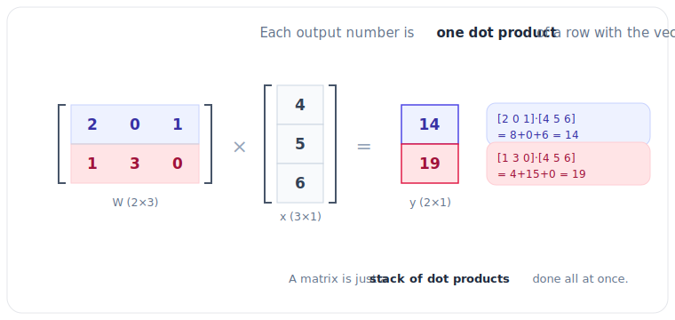

# 1.4 Matrix-Vector Multiplication: The Engine of AI

[](https://colab.research.google.com/github/bzenowich/learnai/blob/main/notebooks/module-01-math/1.4-matrix-vector-multiplication.ipynb)

In the last section, we learned that a [matrix](../glossary.md#matrix) can represent a "transformation" or a "rule." But how do we actually apply that rule to a piece of data (a vector)? 

We use [**Matrix-Vector Multiplication**](../glossary.md#matrix-vector-multiplication).

## The Secret: It's Just Dot Products!

Matrix-vector multiplication might look complicated at first, but it has a secret: **It is just a series of [dot products](../glossary.md#dot-product).**



When you multiply a matrix ($M$) by a vector ($v$), the result is a **new vector**. 

If we have a $3 \times 3$ matrix and a $3 \times 1$ vector:
1.  The first element of the new vector is the **dot product** of the matrix's **first row** and the vector.
2.  The second element is the **dot product** of the matrix's **second row** and the vector.
3.  The third element is the **dot product** of the matrix's **third row** and the vector.

$$
\begin{bmatrix}
\text{Row 1} \\
\text{Row 2} \\
\text{Row 3}
\end{bmatrix} \times v = 
\begin{bmatrix}
\text{Row 1} \cdot v \\
\text{Row 2} \cdot v \\
\text{Row 3} \cdot v
\end{bmatrix}
$$

## Matrix-Vector Multiplication in Python

NumPy makes this incredibly easy. We use the same `@` symbol we used for dot products!

```python
import numpy as np

# Let's create a transformation matrix
# This matrix will double the first value and triple the second value
transformation_matrix = np.array([
    [2.0, 0.0, 0.0],
    [0.0, 3.0, 0.0],
    [0.0, 0.0, 1.0]
])

# Our original vector
v = np.array([10.0, 5.0, 2.0])

# Multiply them together!
new_v = transformation_matrix @ v

print("Original vector:")
print(v)

print("\nTransformed vector (multiplied by the matrix):")
print(new_v)
```

Running this prints:

```text
Original vector:
[10.  5.  2.]

Transformed vector (multiplied by the matrix):
[20. 15.  2.]
```

In the example above, the matrix "transformed" the vector `[10, 5, 2]` into `[20, 15, 2]`. It followed the rules we put in the matrix!

## Why is this the "Engine" of AI?

Every single time you talk to an AI like ChatGPT, it is performing **trillions** of these matrix-vector multiplications. 

1.  **The Inputs:** Your question is converted into a vector.
2.  **The Weights:** The model's "knowledge" is stored in massive matrices (the "weights").
3.  **The Process:** The input vector is multiplied by weight matrix after weight matrix.
4.  **The Result:** Each multiplication transforms the vector, refining its "understanding" of your question until it produces the perfect response vector.

When someone says an AI model has "175 Billion Parameters," they are mostly talking about the numbers stored inside these weight matrices!

## Exercises

**Exercise 1:** Manually compute the result of multiplying a 2x3 matrix by a 3-element vector, then verify with NumPy.

<details>
<summary>Show solution</summary>

Matrix: [[1, 2, 3], [4, 5, 6]], Vector: [1, 2, 3]
- Result[0] = (1×1) + (2×2) + (3×3) = 1 + 4 + 9 = 14
- Result[1] = (4×1) + (5×2) + (6×3) = 4 + 10 + 18 = 32

```python
import numpy as np

matrix = np.array([
    [1.0, 2.0, 3.0],
    [4.0, 5.0, 6.0]
])
vector = np.array([1.0, 2.0, 3.0])

result = matrix @ vector
print(f"Result: {result}")
```

Expected output:
```text
Result: [14. 32.]
```

</details>

**Exercise 2:** Create a 3x3 transformation matrix that scales a vector (multiplies all elements by a constant). What matrix would triple all values?

<details>
<summary>Show solution</summary>

A scaling matrix multiplies all elements by a constant. To triple values, use 3 on the diagonal:

```python
import numpy as np

scaling_matrix = np.array([
    [3.0, 0.0, 0.0],
    [0.0, 3.0, 0.0],
    [0.0, 0.0, 3.0]
])

v = np.array([1.0, 2.0, 3.0])
result = scaling_matrix @ v

print(f"Original: {v}")
print(f"Tripled: {result}")
```

Expected output:
```text
Original: [1. 2. 3.]
Tripled: [3. 6. 9.]
```

</details>

**Exercise 3:** If you have a matrix that transforms vectors from 4 dimensions to 2 dimensions, what is the shape of that matrix? Verify your answer with a concrete example.

<details>
<summary>Show solution</summary>

The matrix shape should be 2×4 (2 rows for 2 outputs, 4 columns for 4 inputs).

```python
import numpy as np

# Matrix: 4 inputs → 2 outputs
matrix = np.array([
    [1.0, 2.0, 3.0, 4.0],
    [5.0, 6.0, 7.0, 8.0]
])

vector = np.array([1.0, 1.0, 1.0, 1.0])
result = matrix @ vector

print(f"Matrix shape: {matrix.shape}")
print(f"Vector shape: {vector.shape}")
print(f"Result shape: {result.shape}")
print(f"Result: {result}")
```

Expected output:
```text
Matrix shape: (2, 4)
Vector shape: (4,)
Result shape: (2,)
Result: [10. 26.]
```

</details>

---

**Up Next:** We've mastered the math! Now, let's see how we can use this to build a tiny "brain" in [**1.5 From Math to Neurons**](1.5-from-math-to-neurons.md).
