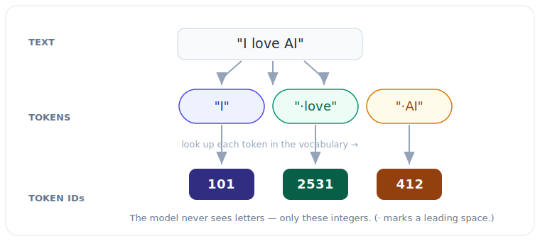

# 2.1 Tokenization: Translating Text into Numbers

[](https://colab.research.google.com/github/bzenowich/learnai/blob/main/notebooks/module-02-text/2.1-tokenization.ipynb)

We know that an AI's brain is made of math. But how do we turn a sentence like "I love robots" into something that a matrix-vector multiplication can understand?

The first step in that translation process is called **[Tokenization](../glossary.md#tokenization)**.



## What is a Token?

A "Token" is a small chunk of text that an AI uses as its basic unit of meaning. If you think of a sentence as a Lego set, tokens are the individual blocks used to build it.

There are three main ways to tokenize text:

1.  **Word-Level:** Every word is a token. 
    *   Example: `["I", "love", "robots"]`
    *   *Problem:* This leads to a massive vocabulary. "Run," "Running," and "Runner" are all treated as completely different things.
2.  **Character-Level:** Every single letter is a token.
    *   Example: `["I", " ", "l", "o", "v", "e", " ", "r", "o", "b", "o", "t", "s"]`
    *   *Problem:* It's hard for the AI to learn the meaning of words if it's only looking at one letter at a time.
3.  **Sub-word Level:** This is the "sweet spot" used by modern AI like ChatGPT. It breaks words into smaller, meaningful pieces.
    *   Example: `["I", " love", " robot", "s"]`
    *   *Benefit:* It can handle new words by breaking them down into parts it already knows (e.g., "un-helpful-ly").

## A Simple Tokenizer in Python

Let's build a very basic word-level tokenizer to see how it works. We'll create a **Vocabulary** (a dictionary that maps words to numbers).

```python
# Our tiny training dataset
corpus = "I love AI. AI is the future. I love robots."

# 1. Clean and split the text into words
words = corpus.lower().replace(".", "").split()

# 2. Create a unique list of words (our Vocabulary)
vocab = sorted(list(set(words)))

# 3. Create a dictionary to map words to unique ID numbers
word_to_id = {word: i for i, word in enumerate(vocab)}
id_to_word = {i: word for i, word in enumerate(vocab)}

print("Our Vocabulary:")
print(word_to_id)

# 4. Tokenize a new sentence!
sentence = "I love AI"
tokens = [word_to_id[word] for word in sentence.lower().split()]

print(f"\nOriginal Sentence: {sentence}")
print(f"Tokenized IDs: {tokens}")
```

Running this prints:
```text
Our Vocabulary:
{'ai': 0, 'future': 1, 'i': 2, 'is': 3, 'love': 4, 'robots': 5, 'the': 6}

Original Sentence: I love AI
Tokenized IDs: [2, 4, 0]
```

In this example, the sentence "I love AI" was converted into a list of numbers like `[2, 4, 0]`.

## Why Numbers?

Now that our sentence is a list of numbers, we can use those numbers as **indices** (addresses) to look up something even more powerful: **[Embeddings](../glossary.md#embedding)**.

## Exercises

**Exercise 1:** Create a tokenizer for the corpus `"the cat sat on the mat the dog sat"` and tokenize the sentence `"the cat"`. What are the token IDs? What is the vocabulary size?

<details>
<summary>Show solution</summary>

Build the vocabulary and word-to-ID mapping:

```python
corpus = "the cat sat on the mat the dog sat"
words = corpus.lower().split()
vocab = sorted(list(set(words)))
word_to_id = {word: i for i, word in enumerate(vocab)}
sentence = "the cat"
tokens = [word_to_id[word] for word in sentence.split()]
print(f"Sentence: {sentence}")
print(f"Token IDs: {tokens}")
print(f"Vocabulary size: {len(vocab)}")
```

Running this prints:
```text
Sentence: the cat
Token IDs: [5, 0]
Vocabulary size: 6
```
</details>

**Exercise 2:** Given the corpus `"hello world hello"`, what token IDs are produced when tokenizing `"world hello hello"`?

<details>
<summary>Show solution</summary>

Create the word-to-ID mapping and tokenize:

```python
corpus = "hello world hello"
words = corpus.lower().split()
vocab = sorted(list(set(words)))
word_to_id = {word: i for i, word in enumerate(vocab)}
new_sentence = "world hello hello"
tokens = [word_to_id[word] for word in new_sentence.split()]
print(f"Tokens: {tokens}")
```

Running this prints:
```text
Tokens: [1, 0, 0]
```

The vocabulary is `['hello', 'world']` with IDs `{0: hello, 1: world}`.
</details>

**Exercise 3:** Why might word-level tokenization create a very large vocabulary for real-world text? What is one advantage of sub-word tokenization?

<details>
<summary>Show solution</summary>

Word-level tokenization creates large vocabularies because every unique word in the text requires its own unique ID, including all variations of words (e.g., "run", "runs", "running" are all different tokens). Real-world text contains tens of thousands of words, making the vocabulary size unwieldy.

Sub-word tokenization reduces vocabulary size by breaking words into smaller, meaningful units. This means rare word variations can be represented by combining familiar sub-words, allowing the model to generalize better to new or unseen words.
</details>

---

**Up Next:** Now that we have token IDs, let's turn them into vectors in **2.2 Embeddings**.
