# 3.1 LLM Structure Overview: The Transformer Architecture

Now that we have the mathematical pieces—[**Vectors**](../glossary.md#vector), **Matrices**, and [**Embeddings**](../glossary.md#embedding)—it's time to put them together into a complete system. 

Every modern AI you interact with (like ChatGPT, Claude, or Gemini) is built on a specific architecture called the [**Transformer**](../glossary.md#transformer).

## The High-Level Flow

At its simplest, an LLM is a pipeline that takes a list of input tokens and transforms them through multiple stages to predict the next word in the sequence.

1.  **Input:** You type a prompt.
2.  **Tokenization:** The prompt is broken into Token IDs (Module 2).
3.  **Embedding:** Each Token ID is looked up in the Embedding Matrix to get its starting [vector](../glossary.md#vector).
4.  **Transformer Layers:** This is the core of the model. The vectors pass through 12, 24, or even 96 identical "layers" (Module 1). Each layer makes the model's understanding of the tokens more sophisticated.
5.  **Output Prediction:** The final transformed vectors are used to predict the next [token](../glossary.md#next-token-prediction) (Module 3.4).

## The Core Components of a Layer

Inside each one of those "Transformer Layers" are two primary blocks:

1.  **The [Attention Mechanism](../glossary.md#attention):** This is the most famous part. It allows each word in your prompt to "talk" to every other word to understand context (e.g., if you say "The bank of the river," Attention helps the word "bank" know you don't mean a place to keep money).
2.  **The Feed-Forward Network:** This is essentially the "Neuron Layer" we built in Module 1.5. It processes the contextual information from the Attention stage to refine the vector even further.

## Why "Layers"?

Imagine you're trying to understand a complex poem. 
*   In the **first layer**, you might just recognize the individual words. 
*   In the **middle layers**, you might start to see the sentences and basic grammar. 
*   In the **final layers**, you start to understand the abstract themes, metaphors, and tone.

Each layer in an LLM works similarly. By stacking many layers on top of each other, the model goes from simple word recognition to complex reasoning.

## Exercises

Exercise 1: Understanding the Embedding Layer

Explain why each token gets transformed into a vector, and why that vector contains semantic information. What would happen if all tokens were mapped to the same vector?

Show solution

Tokens in a language model must be converted to vectors because:
1. Neural networks operate on numbers, not words.
2. The vector captures semantic meaning — similar words have similar vectors.
3. During training, gradients update these vectors so that related words cluster together.

If all tokens mapped to the same vector, the model would have no way to distinguish between different words, making language modeling impossible. Each token needs its own identity encoded in its starting vector.

Exercise 2: Layer Depth and Abstraction

A 12-layer model processes tokens differently than a 96-layer model. Describe what might happen at early layers vs. deep layers in terms of what linguistic features are captured.

Show solution

- **Early Layers (1-4):** Capture simple, local features like parts of speech, grammar, and nearby word relationships. "The" and "a" might become similar.
- **Middle Layers (5-8):** Capture sentence structure, subject-verb-object relationships, and broader context.
- **Deep Layers (9-12+):** Capture semantic meaning, intent, tone, and high-level reasoning. These layers produce vectors that encode the full context for predicting the next token.

The progression from simple to complex features is why deeper models are more capable — they have more stages to refine their understanding.

Exercise 3: Residual Connections Across Layers

Why is it important that each Transformer layer adds its input back to its output (a residual connection)? What problem might occur if we didn't have this?

Show solution

Residual connections serve two key purposes:

1. **Gradient Flow:** In very deep networks (96+ layers), gradients can vanish when backpropagating through multiplication operations. Skip connections provide a direct path for gradients to flow back to earlier layers, preventing the vanishing gradient problem.

2. **Information Preservation:** Without residual connections, each layer is forced to represent all information in its output. With skip connections, layers can learn incremental refinements rather than completely recomputing everything.

If we removed residual connections:
- Training deep models would become extremely difficult.
- Information from the input would get "lost" in deep layers.
- The model would need to learn to reconstruct all basic information at each layer, wasting capacity.

This is why residual connections are fundamental to modern deep learning.

---

**Up Next:** Let's zoom into the most important block of all: **3.2 The Attention Mechanism**.
