# 3.2 The Attention Mechanism: Understanding Context

[](https://colab.research.google.com/github/bzenowich/learnai/blob/main/notebooks/module-03-llm/3.2-attention-mechanism.ipynb)

In the previous section, we learned that a Transformer's job is to refine word vectors. The most important tool it uses to do this is called [**Attention**](../glossary.md#attention).

## Why Attention?

In human language, the meaning of a word changes depending on the words around it. Consider the word "bank":
*   "I went to the **bank** to deposit money."
*   "I sat on the **bank** of the river."

To an AI, the starting embedding vector for "bank" is the same in both sentences. [**Attention**](../glossary.md#attention) is the mechanism that allows the AI to "look" at the other words in the sentence (like "money" or "river") and update the vector for "bank" to reflect its true meaning.

## How it Works: [Queries, Keys, and Values](../glossary.md#query-key-and-value)

The Transformer uses three separate vectors for every token in a sentence:



1.  **Query ($Q$):** "What am I looking for?" (What kind of context do I need?)
2.  **Key ($K$):** "What do I contain?" (What kind of information can I provide to others?)
3.  **Value ($V$):** "What information do I give?" (The actual content I'm sharing.)

### The Three-Step Process

1.  **Similarity Check (Dot Product):** Every token's **Query** is compared (via [dot product](../glossary.md#dot-product)!) to every other token's **Key**. This creates an **Attention Score**.
2.  **Normalize ([Softmax](../glossary.md#softmax)):** These scores are turned into percentages that all add up to 100%. This tells the model exactly how much "attention" to pay to each word.
3.  **Aggregate (Weighted Sum):** We multiply those percentages by each token's **Value** and add them up. The result is a new, context-aware vector!

## Simple Attention in Python

Let's imagine we have three tokens: `["The", "river", "bank"]`.

```python
import numpy as np

# Let's say we've already calculated our Q, K, and V vectors for "bank"
# (In a real model, these are produced by matrix-vector multiplication!)
bank_query = np.array([1.0, 0.0, 0.5])

# The Keys for each of our three words
keys = np.array([
    [0.1, 0.1, 0.1], # "The"
    [0.9, 0.0, 0.4], # "river"
    [1.0, 0.1, 0.5]  # "bank"
])

# 1. Calculate the Similarity (Dot Product)
scores = keys @ bank_query

# 2. Normalize with Softmax (with numerical stability)
# Subtract max for stability, exponentiate, then divide by sum
exp_scores = np.exp(scores - np.max(scores))
attention_weights = exp_scores / np.sum(exp_scores)

print(f"Attention Weights for 'bank':")
print(f"'The':   {attention_weights[0]:.2%}")
print(f"'river': {attention_weights[1]:.2%}")
print(f"'bank':  {attention_weights[2]:.2%}")
```

Running this prints:
```text
Attention Weights for 'bank':
'The':   15.17%
'river': 39.24%
'bank':  45.59%
```

In this example, the word "bank" paid the most attention to itself (45.59%), then to "river" (39.24%). The resulting vector for "bank" will now incorporate the meaning of "river" and itself more than it does "The."

## Why Softmax? The Role of Exponential Scaling

You might wonder: why use exponential scaling at all? Why not just divide by the sum like we originally described?

The answer has three parts:

1. **Positivity:** The exponential function `exp(x)` always produces positive values, even when input scores are negative. This is crucial because simple division can produce negative weights, which makes no sense for a probability distribution. Softmax guarantees all weights are between 0 and 1.

2. **Amplification:** Softmax amplifies differences between scores. Larger scores get exponentially more weight than smaller ones, sharpening the model's focus on the most relevant tokens. For example, if one score is just slightly higher than another, softmax will make the difference in attention weights much more dramatic, helping the model make clearer choices.

3. **Probability Distribution:** The exponential normalization ensures weights always sum to exactly 1.0, forming a valid probability distribution. This is mathematically elegant and allows us to interpret attention as a true distribution over which tokens to "look at." 

## [Multi-Head Attention](../glossary.md#multi-head-attention)

In real LLMs, this process doesn't happen just once. It happens many times simultaneously (called [**Multi-Head Attention**](../glossary.md#multi-head-attention)). One "head" might look for grammar, another for meaning, another for tone, and so on. This is what allows an LLM to be so sophisticated.

## Exercises

<details>
<summary>Exercise 1: Softmax with Negative Scores</summary>

Show why the plain division approach `scores / sum(scores)` fails when scores are negative, but softmax works. Start with scores `[-2, 0, 1]`.

<details>
<summary>Show solution</summary>

```python
import numpy as np

scores = np.array([-2.0, 0.0, 1.0])

# Wrong approach: plain division produces negative weights!
wrong_weights = scores / np.sum(scores)
print("Plain division (WRONG):")
print(f"Weights: {wrong_weights}")
print(f"Contains negatives? {np.any(wrong_weights < 0)}")

# Correct approach: softmax
exp_scores = np.exp(scores - np.max(scores))
softmax_weights = exp_scores / np.sum(exp_scores)
print("\nSoftmax (CORRECT):")
print(f"Weights: {softmax_weights}")
print(f"Sum: {softmax_weights.sum():.4f}")
print(f"All positive? {np.all(softmax_weights > 0)}")
```

Expected output:
```text
Plain division (WRONG):
Weights: [-0.4  0.   0.4]
Contains negatives? True

Softmax (CORRECT):
Weights: [0.05226423 0.14190823 0.80582754]
Sum: 1.0000
All positive? True
```

The key insight: softmax converts any scores (negative, zero, or positive) into a valid probability distribution with all weights positive and summing to 1.0.

</details>
</details>

<details>
<summary>Exercise 2: Softmax Amplification</summary>

Compare softmax outputs for two sets of scores where only the highest score differs slightly. Show how softmax amplifies small differences in the input into larger differences in attention weights.

<details>
<summary>Show solution</summary>

```python
import numpy as np

# Set 1: scores are close together
scores1 = np.array([1.0, 1.2, 1.5])

# Set 2: scores have a larger gap
scores2 = np.array([1.0, 1.2, 2.5])

def softmax(x):
    exp_x = np.exp(x - np.max(x))
    return exp_x / exp_x.sum()

weights1 = softmax(scores1)
weights2 = softmax(scores2)

print("Softmax Amplification:")
print(f"Scores 1: {scores1} (gap: {scores1[2] - scores1[0]:.1f})")
print(f"Weights 1: {weights1}")
print(f"Max weight ratio: {weights1[2] / weights1[0]:.2f}x")

print(f"\nScores 2: {scores2} (gap: {scores2[2] - scores2[0]:.1f})")
print(f"Weights 2: {weights2}")
print(f"Max weight ratio: {weights2[2] / weights2[0]:.2f}x")

print(f"\nNotice: doubling the score gap (~1.5x) resulted in ~4x stronger amplification!")
```

Expected output:
```text
Softmax Amplification:
Scores 1: [1.  1.2 1.5] (gap: 0.5)
Weights 1: [0.21194156 0.28583233 0.50222611]
Max weight ratio: 2.37x

Scores 2: [1.  1.2 2.5] (gap: 1.5)
Weights 2: [0.05226423 0.08560124 0.86213453]
Max weight ratio: 16.51x

Notice: doubling the score gap (~1.5x) resulted in ~4x stronger amplification!
```

This amplification is why softmax is powerful: small differences in dot products become meaningful differences in which tokens the model pays attention to.

</details>
</details>

<details>
<summary>Exercise 3: Multi-Head Attention Simulation</summary>

Simulate two different attention "heads" looking at the same tokens but computing different attention patterns (e.g., one focusing on semantic similarity, one on proximity).

<details>
<summary>Show solution</summary>

```python
import numpy as np

def softmax(x):
    exp_x = np.exp(x - np.max(x))
    return exp_x / exp_x.sum()

# Tokens: ["The", "river", "bank"]
tokens = ["The", "river", "bank"]

# Head 1: Semantic similarity (focuses on semantic relevance)
# "bank" query, "river" has high semantic relevance
semantic_scores = np.array([0.1, 3.5, 2.8])

# Head 2: Positional proximity (focuses on nearby tokens)
# "bank" is the last token, so earlier tokens get less attention
positional_scores = np.array([0.1, 1.0, 5.0])

semantic_weights = softmax(semantic_scores)
positional_weights = softmax(positional_scores)

print("Semantic Head (focuses on 'river'):")
for token, weight in zip(tokens, semantic_weights):
    print(f"  {token}: {weight:.2%}")

print("\nPositional Head (focuses on 'bank'):")
for token, weight in zip(tokens, positional_weights):
    print(f"  {token}: {weight:.2%}")

print("\nKey insight: Different heads specialize in different aspects!")
print(f"Semantic head attends more to 'river' (relevant concept)")
print(f"Positional head attends more to 'bank' (current token)")
```

Expected output:
```text
Semantic Head (focuses on 'river'):
  The: 0.13%
  river: 94.41%
  bank: 5.46%

Positional Head (focuses on 'bank'):
  The: 0.09%
  river: 0.66%
  bank: 99.25%

Key insight: Different heads specialize in different aspects!
Semantic head attends more to 'river' (relevant concept)
Positional head attends more to 'bank' (current token)
```

</details>
</details>

---

**Up Next:** Now that we've updated our context, what's next? Let's go **3.3 Layer by Layer** through the model.
