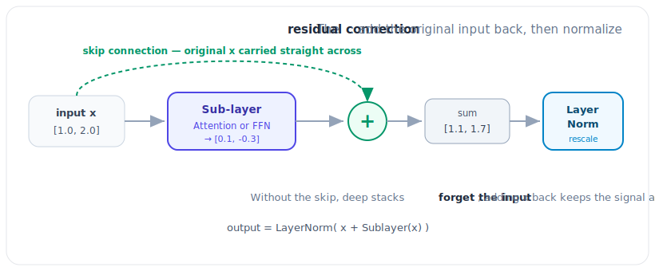

# 3.3 Layer by Layer: The Transformer Block

[](https://colab.research.google.com/github/bzenowich/learnai/blob/main/notebooks/module-03-llm/3.3-layer-by-layer.ipynb)

In the previous sections, we saw the two main components of a Transformer layer: [**Attention**](../glossary.md#attention) (which handles context) and the **Feed-Forward Network** (which handles processing). 

But there are two more "utility" steps that make these layers stable and powerful: **Residual Connections** and **Layer Normalization**.

## The Anatomy of a Single Layer

If we zoom in on one of the 12 to 96 layers in a model, it looks like this:



1.  **Input Vector:** The current state of the word embeddings.
2.  **Attention Block:** Words talk to each other to update their meaning based on context.
3.  **Residual Connection & Add:** We take the *original* input and add it back to the result of the Attention block. This "skip connection" helps information flow through many layers without getting lost.
4.  **Layer Normalization:** We "squash" the numbers to keep them from getting too large or too small. This keeps the math stable.
5.  **Feed-Forward Block:** The context-aware vectors are passed through the neuron-like weight matrices we learned about in Module 1.5.
6.  **Residual Connection & Add (Again):** We add the input from Step 4 back to the output of Step 5.
7.  **Layer Normalization (Again):** One final "squash" before passing the vector to the *next* layer.

## Conceptualizing the "Add & Norm" in Python

While the actual math for Layer Normalization is a bit more involved, we can think of it as a way to keep our vectors "behaved."

```python
import numpy as np

def simple_layer_norm(v):
    # This is a VERY simplified version of LayerNorm
    # It ensures the mean is 0 and the standard deviation is 1
    mean = np.mean(v)
    std = np.std(v)
    return (v - mean) / (std + 1e-6)

# 1. Our Input Vector
input_v = np.array([1.2, -0.5, 0.8])

# 2. Simulated Attention Step
# Let's say Attention shifted the numbers slightly
attention_output = np.array([0.1, 0.4, -0.2])

# 3. Residual Connection (Add the original input back!)
# This is a key secret to deep learning!
combined_v = input_v + attention_output

# 4. Layer Normalization
final_output = simple_layer_norm(combined_v)

print(f"Original Input: {input_v}")
print(f"After Attention + Residual: {combined_v}")
print(f"After Layer Norm: {final_output}")
```

Running this prints:
```text
Original Input: [ 1.2 -0.5  0.8]
After Attention + Residual: [ 1.3 -0.1  0.6]
After Layer Norm: [ 1.22474273 -1.22474273  0.        ]
```

## Why do we need so many layers?

Each layer is a "stage" of refinement. 

*   **Early Layers:** Focus on local context (like identifying that "bank" is a noun and relates to "river").
*   **Middle Layers:** Focus on sentence structure and logic (understanding the subject, verb, and object).
*   **Deep Layers:** Focus on abstract concepts (understanding the sentiment, the intent of the speaker, and what should come next).

By the time the vector reaches the very last layer, it has been "transformed" from a simple dictionary definition into a highly sophisticated representation of a concept within a specific conversation.

## Exercises

<details>
<summary>Exercise 1: Layer Normalization Purpose</summary>

Why is Layer Normalization crucial in deep neural networks? What problems can occur without it?

<details>
<summary>Show solution</summary>

Layer Normalization is crucial for:

1. **Numerical Stability:** As vectors pass through many layers, their magnitudes can grow exponentially (exploding gradients) or shrink to zero (vanishing gradients). Layer Norm keeps magnitudes controlled by normalizing to mean 0 and std 1.

2. **Training Speed:** Normalized inputs allow higher learning rates and faster convergence during training.

3. **Prevents Saturation:** Large activations can saturate nonlinear functions (like ReLU), causing gradients to vanish. Keeping values in a reasonable range prevents this.

Without Layer Norm in a 96-layer model:
- Early layers might produce vectors with magnitude 0.0001
- Deep layers might have magnitudes 1000000
- This breaks both forward pass and backpropagation

This is why Layer Norm is applied after every major transformation in modern Transformers.

</details>
</details>

<details>
<summary>Exercise 2: Residual Connections and Information Flow</summary>

Implement a simplified version showing how residual connections allow information to "skip" layers. Compare a network with and without skip connections over multiple iterations.

<details>
<summary>Show solution</summary>

```python
import numpy as np

def simple_layer_norm(v):
    mean = np.mean(v)
    std = np.std(v)
    return (v - mean) / (std + 1e-6)

# Initial vector
original_vector = np.array([1.0, 0.5, -0.3])

# Scenario 1: WITHOUT residual connections
# Each layer computes new output, discarding the input
output_no_residual = original_vector.copy()
for layer in range(5):
    # Simulate a transformation
    output_no_residual = np.tanh(output_no_residual * 0.5)
    output_no_residual = simple_layer_norm(output_no_residual)

# Scenario 2: WITH residual connections
# Each layer adds its input to its output
output_with_residual = original_vector.copy()
for layer in range(5):
    transformation = np.tanh(output_with_residual * 0.5)
    transformation = simple_layer_norm(transformation)
    output_with_residual = output_with_residual + transformation  # Skip connection

print("Original vector:", original_vector)
print("After 5 layers WITHOUT residual:", output_no_residual)
print("After 5 layers WITH residual:", output_with_residual)
print("\nWith residual: information is preserved and accumulated")
```

Expected output:
```text
Original vector: [ 1.   0.5 -0.3]
After 5 layers WITHOUT residual: [ 0.70710678 -0.70710678  0.        ]
After 5 layers WITH residual: [ 1.18570842  0.27928686 -0.46499528]

With residual: information is preserved and accumulated
```

Notice how residual connections preserve aspects of the original vector, while the non-residual version gets "compressed" toward a fixed point.

</details>
</details>

<details>
<summary>Exercise 3: Understanding Normalizing Before vs. After</summary>

In modern Transformers, Layer Norm is often applied before the main computation (pre-norm) rather than after. Why might this be beneficial?

<details>
<summary>Show solution</summary>

Pre-norm (normalize → process) offers several advantages over post-norm (process → normalize):

1. **Better Gradient Flow:** In pre-norm, residual paths remain unnormalized, providing high-magnitude gradient signals that flow cleanly through skip connections. This helps very deep models (96+ layers) train better.

2. **Training Stability:** Pre-norm acts as a natural regularizer, preventing weight explosion during training.

3. **Empirical Performance:** Studies show pre-norm consistently outperforms post-norm in very deep architectures.

Example code showing the structural difference:

```python
def post_norm_layer(x, attention_fn, ff_fn):
    # Process first, normalize after
    x = x + attention_fn(x)
    x = simple_layer_norm(x)  # Post-norm
    x = x + ff_fn(x)
    x = simple_layer_norm(x)
    return x

def pre_norm_layer(x, attention_fn, ff_fn):
    # Normalize first, process after
    x = x + attention_fn(simple_layer_norm(x))
    x = x + ff_fn(simple_layer_norm(x))  # Pre-norm
    return x
```

Pre-norm is now standard in state-of-the-art models (GPT-3, PaLM, LLaMA).

</details>
</details>

---

**Up Next:** We've reached the top of the tower! Now, let's see how the model uses these final vectors to produce text in **3.4 Next-Token Prediction**.
