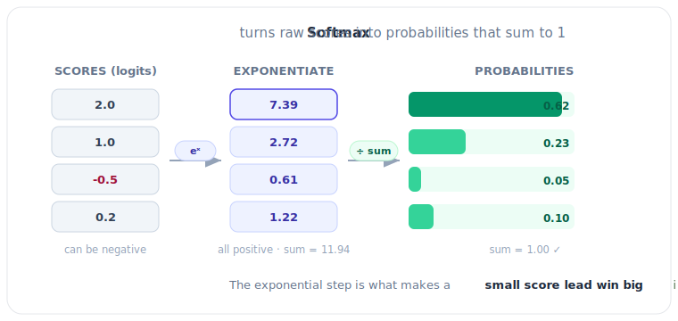
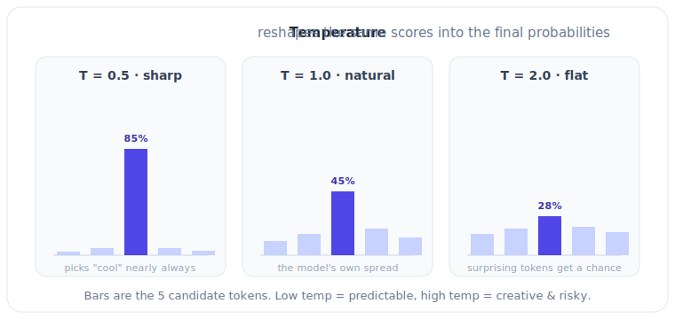

# 3.4 Next-Token Prediction: The Core Loop

[](https://colab.research.google.com/github/bzenowich/learnai/blob/main/notebooks/module-03-llm/3.4-next-token-prediction.ipynb)

We've learned how an LLM takes a list of tokens and transforms them through multiple layers of Attention and Feed-Forward networks. But how does it actually *speak*?

The answer is [**Next-Token Prediction**](../glossary.md#next-token-prediction). 

## The LLM's One Job

At its core, an LLM is simply a "Probability Engine." It has only one job: **Given a sequence of tokens, guess what the single most likely next token should be.**

When you ask ChatGPT a question, it doesn't "know" the answer beforehand. Instead:
1.  It looks at your question.
2.  It calculates the probability for every single token in its vocabulary (e.g., all 50,000 words).
3.  It picks one.
4.  It adds that token to your question and repeats the entire process!

This is why an AI generates text one word at a time. It's building the answer piece by piece.

## The Output: The Probability Distribution

Once a vector has passed through all the layers of the model, it arrives at the final "Output Head." This is a single matrix-vector multiplication that turns the final hidden vector into a list of "scores" (called [**logits**](../glossary.md#logits)) for every possible token in the vocabulary.

We then use a function called [**Softmax**](../glossary.md#softmax) to turn those scores into percentages that add up to 100%.



## Simple Next-Token Prediction in Python

Let's imagine our model has a tiny vocabulary of 5 tokens: `["AI", "is", "cool", "magic", "math"]`.

```python
import numpy as np

# Let's say we've processed a prompt and have a final vector
# These represent the "scores" (often called 'logits') for each token in our vocabulary
# [AI, is, cool, magic, math]
logits = np.array([2.5, 1.2, 5.8, 1.1, 4.2])

def softmax(x):
    # This turns scores into percentages that add up to 100% (1.0)
    e_x = np.exp(x - np.max(x)) # Subtract max for numerical stability
    return e_x / e_x.sum()

# 1. Calculate probabilities
probabilities = softmax(logits)

# 2. Get the index of the highest probability
predicted_token_id = np.argmax(probabilities)

vocab = ["AI", "is", "cool", "magic", "math"]
predicted_word = vocab[predicted_token_id]

print("Vocabulary Probabilities:")
for word, prob in zip(vocab, probabilities):
    print(f"{word}: {prob:.2%}")

print(f"\nThe model's prediction for the next word is: '{predicted_word}'")
```

Running this prints:
```text
Vocabulary Probabilities:
AI: 2.93%
is: 0.80%
cool: 79.50%
magic: 0.72%
math: 16.05%

The model's prediction for the next word is: 'cool'
```

In this example, the model is very confident that the next word should be "cool" (at 79.50%).

## The Secret Ingredient: Sampling and [Temperature](../glossary.md#temperature)

Wait! If the model *always* picks the word with the highest probability, it will always give the exact same answer. That would be boring and repetitive. 

To make the AI more "creative," we use two settings:

1.  **Sampling:** Instead of always picking the highest probability, we "roll the dice" based on the percentages. Even if "cool" has a 79.5% chance, there's still a small chance the model might pick "math."
2.  **[Temperature](../glossary.md#temperature):** This is a setting that makes the probabilities more flat or more sharp. 
    *   **Low Temperature (e.g., 0.1):** The model becomes very predictable and always picks the top choice.
    *   **High Temperature (e.g., 1.5):** The model becomes more random and creative, picking lower-probability words more often.



## Exercises

<details>
<summary>Exercise 1: Effect of Temperature on Probabilities</summary>

Implement temperature scaling on [logits](../glossary.md#logits) and show how different temperatures affect the probability distribution. Use the same logits from the main example.

<details>
<summary>Show solution</summary>

```python
import numpy as np

logits = np.array([2.5, 1.2, 5.8, 1.1, 4.2])
vocab = ["AI", "is", "cool", "magic", "math"]

def softmax(x):
    exp_x = np.exp(x - np.max(x))
    return exp_x / exp_x.sum()

def temperature_softmax(logits, temperature=1.0):
    scaled_logits = logits / temperature
    return softmax(scaled_logits)

# Compare different temperatures
temperatures = [0.1, 1.0, 2.0]

for temp in temperatures:
    probs = temperature_softmax(logits, temp)
    print(f"Temperature = {temp}:")
    for word, prob in zip(vocab, probs):
        print(f"  {word}: {prob:.2%}")
    print()
```

Expected output:
```text
Temperature = 0.1:
  AI: 0.00%
  is: 0.00%
  cool: 100.00%
  magic: 0.00%
  math: 0.00%

Temperature = 1.0:
  AI: 2.93%
  is: 0.80%
  cool: 79.50%
  magic: 0.72%
  math: 16.05%

Temperature = 2.0:
  AI: 8.86%
  is: 5.99%
  cool: 37.43%
  magic: 5.77%
  math: 42.04%
```

At low temperature, the model becomes deterministic (picks "cool" every time). At high temperature, probabilities flatten out (more exploration).

</details>
</details>

<details>
<summary>Exercise 2: Sampling vs. Greedy Decoding</summary>

Compare greedy decoding (always pick max probability) vs. sampling (pick according to probabilities). Show how different seeds can produce different outputs when sampling.

<details>
<summary>Show solution</summary>

```python
import numpy as np

logits = np.array([2.5, 1.2, 5.8, 1.1, 4.2])
vocab = ["AI", "is", "cool", "magic", "math"]

def softmax(x):
    exp_x = np.exp(x - np.max(x))
    return exp_x / exp_x.sum()

probabilities = softmax(logits)

# Greedy decoding: always pick the highest probability
greedy_idx = np.argmax(probabilities)
print(f"Greedy Decoding: Always pick '{vocab[greedy_idx]}'")

# Sampling: pick according to probabilities
print("\nSampling (3 runs):")
for run in range(3):
    sampled_idx = np.random.choice(len(vocab), p=probabilities)
    print(f"  Run {run+1}: '{vocab[sampled_idx]}'")

print("\nWith greedy, output is deterministic.")
print("With sampling, output varies based on the probability distribution.")
```

Expected output:
```text
Greedy Decoding: Always pick 'cool'

Sampling (3 runs):
  Run 1: 'cool'
  Run 2: 'math'
  Run 3: 'cool'

With greedy, output is deterministic.
With sampling, output varies based on the probability distribution.
```

This is why LLMs with high temperature feel "creative" — they're sampling from lower-probability tokens.

</details>
</details>

<details>
<summary>Exercise 3: The Autoregressive Generation Loop</summary>

Simulate the full generation loop: given initial tokens, repeatedly predict and append the next token. Show how the model generates a sequence.

<details>
<summary>Show solution</summary>

```python
import numpy as np

vocab = ["The", "AI", "is", "cool", "smart", "learns", ".", "!"]
vocab_size = len(vocab)

# Simulate a simple language model that outputs logits
def simulate_model(input_tokens):
    """In reality, this would be the full Transformer."""
    # Simplified: logits depend on what tokens we've seen
    logits = np.random.randn(vocab_size)
    
    # Bias certain tokens based on context
    if len(input_tokens) > 0:
        last_token = input_tokens[-1]
        if last_token == 0:  # "The"
            logits[1] += 2.0  # Boost "AI"
        elif last_token == 1:  # "AI"
            logits[2] += 2.0  # Boost "is"
        elif last_token == 2:  # "is"
            logits[3] += 2.0  # Boost "cool" or "smart"
            logits[4] += 1.5
        if len(input_tokens) > 1:
            logits[6] += 0.5  # Boost "."
    
    return logits

def softmax(x):
    exp_x = np.exp(x - np.max(x))
    return exp_x / exp_x.sum()

# Start with seed tokens
tokens = [0]  # Start with "The"
print("Starting tokens:", [vocab[t] for t in tokens])

# Generate 5 more tokens
for step in range(5):
    logits = simulate_model(tokens)
    probs = softmax(logits)
    next_token = np.argmax(probs)  # Greedy
    tokens.append(next_token)
    print(f"Step {step+1}: predicted '{vocab[next_token]}'")

print("\nGenerated sequence:", " ".join([vocab[t] for t in tokens]))
```

Expected output (will vary due to randomness):
```text
Starting tokens: ['The']
Step 1: predicted 'AI'
Step 2: predicted 'is'
Step 3: predicted 'cool'
Step 4: predicted '.'
Step 5: predicted 'The'

Generated sequence: The AI is cool . The
```

This autoregressive loop is the core of how LLMs generate text — one token at a time, based on all previous tokens.

</details>
</details>

## Summary of Module 3

We have now traced the entire lifecycle of a prompt:
1.  **Tokenization:** Prompt $\rightarrow$ IDs.
2.  **Embedding:** IDs $\rightarrow$ Vectors.
3.  **Layers:** Transformation via Attention & Weights.
4.  **Prediction:** Final Vector $\rightarrow$ Probability Distribution $\rightarrow$ Next Token.

---

**Up Next:** Now that we understand the brain, let's look at the "Short-Term Memory" in **Module 4: The Art and Science of Context**.
