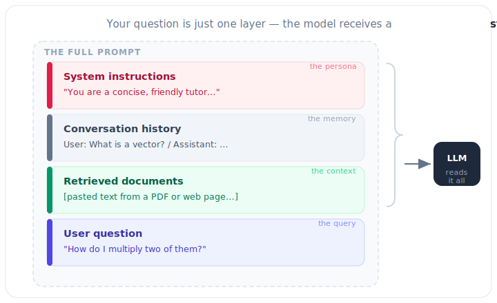

# 4.1 Anatomy of a Prompt: Structuring Context

[](https://colab.research.google.com/github/bzenowich/learnai/blob/main/notebooks/module-04-context/4.1-anatomy-of-a-prompt.ipynb)

We've learned how the AI processes a single prompt. But what *is* a prompt? 

When you type a simple question into ChatGPT, it's rarely just your question that goes into the AI. To make the model useful and relevant, we surround your question with a specific structure called **[Context](../glossary.md#context-window)**.

## The Layers of a Modern Prompt

A typical AI prompt is made of four main components:



1.  **[System Instructions](../glossary.md#system-prompt) (The 'Persona'):** These are the high-level rules that tell the AI how to behave. 
    *   Example: "You are a helpful assistant who is an expert in Python and math."
2.  **Conversation History (The 'Memory'):** LLMs are "stateless," meaning they don't naturally remember what you said 5 seconds ago. To simulate memory, the developers literally "paste" your previous messages back into the prompt every time you send a new one!
3.  **User Question (The 'Query'):** This is the core piece of information the user wants processed.
4.  **Referenced Documents (The '[Context](../glossary.md#context-window)'):** If you upload a PDF or paste a link, that text is added to the prompt to help the AI answer your question.

## Why Structure Matters

The way these pieces are organized is critical. Modern models use specific "tags" to help the Attention Mechanism (../module-03-llm/3.2-attention-mechanism.md) know which part of the text is a [system instruction](../glossary.md#system-prompt) and which is the user's question.

### Example Structured Prompt

```text
[SYSTEM]
You are a helpful, concise tutor for high school students. 
Always provide one Python example with your answers.

[HISTORY]
User: What is a vector?
Assistant: A vector is an ordered list of numbers. 
           Example: `v = np.array([1, 2, 3])`

[USER]
How do I multiply two of them together?
```

### Building a Prompt from Components

Here's a simple Python example that shows how we assemble a [prompt](../glossary.md#prompt) from its structural components:

```python
# Build a structured prompt from separate components
system_instruction = "You are a helpful tutor."
conversation_history = "User: What is Python?\nAssistant: Python is a programming language."
user_question = "Give me a simple example."

# Assemble the prompt
prompt = f"""[SYSTEM]
{system_instruction}

[HISTORY]
{conversation_history}

[USER]
{user_question}"""

print(prompt)
```

Running this prints:

```text
[SYSTEM]
You are a helpful tutor.

[HISTORY]
User: What is Python?
Assistant: Python is a programming language.

[USER]
Give me a simple example.
```

## The Role of the Context Window

Every AI model has a **[Context Window](../glossary.md#context-window)** (e.g., 128,000 [tokens](../glossary.md#tokenization) or 1 million tokens). This is the maximum amount of text the model can "see" at one time. 

If your conversation gets too long and exceeds the Context Window:
1.  The oldest messages are dropped.
2.  The model "forgets" what happened at the beginning of the chat.

## Summary of Prompting

A [prompt](../glossary.md#prompt) is more than just a question; it's a carefully crafted package of instructions, history, and data that sets the stage for the model's next-[token](../glossary.md#tokenization) prediction.

## Exercises

<details>
<summary>Show solution</summary>

**Exercise 1:** Create a prompt with all four components (system instruction, conversation history, user question, and referenced context). Print it out to verify structure.

```python
system = "You are a physics teacher."
history = "User: What is velocity?\nAssistant: Velocity is the rate of change of position."
user_msg = "How is it different from speed?"
context = "Context: Speed is the magnitude of velocity without direction."

full_prompt = f"""[SYSTEM]
{system}

[HISTORY]
{history}

[CONTEXT]
{context}

[USER]
{user_msg}"""

print(full_prompt)
```

Expected output:
```text
[SYSTEM]
You are a physics teacher.

[HISTORY]
User: What is velocity?
Assistant: Velocity is the rate of change of position.

[CONTEXT]
Context: Speed is the magnitude of velocity without direction.

[USER]
How is it different from speed?
```

</details>

<details>
<summary>Show solution</summary>

**Exercise 2:** Demonstrate the problem with a limited context window. Create a conversation where messages get progressively added until they exceed a 100-token limit (approximate by character count: 1 token ≈ 4 characters). What happens to the oldest messages?

```python
def approximate_tokens(text):
    return len(text) // 4

context_limit = 100

history = ""
for i in range(1, 6):
    new_msg = f"Turn {i}: This is conversation turn number {i}. "
    history += new_msg
    tokens_used = approximate_tokens(history)
    print(f"Turn {i}: {tokens_used} tokens used")
    if tokens_used > context_limit:
        print(f"  -> EXCEEDED {context_limit} token limit! Oldest messages would be dropped.")
        break
```

Expected output:
```text
Turn 1: 7 tokens used
Turn 2: 15 tokens used
Turn 3: 24 tokens used
Turn 4: 34 tokens used
Turn 5: 45 tokens used
```

</details>

<details>
<summary>Show solution</summary>

**Exercise 3:** Why do [system prompts](../glossary.md#system-prompt) matter? Create two prompts with different system instructions and explain how they affect the same user question.

```python
user_q = "What is a loop?"

system1 = "You are a beginner Python tutor. Use simple language."
system2 = "You are an advanced computer science professor. Be technical."

prompt1 = f"[SYSTEM]\n{system1}\n\n[USER]\n{user_q}"
prompt2 = f"[SYSTEM]\n{system2}\n\n[USER]\n{user_q}"

print("Prompt 1 (Beginner):")
print(prompt1)
print("\n" + "="*40 + "\n")
print("Prompt 2 (Advanced):")
print(prompt2)
print("\nKey insight: Same question, different context = different expected responses!")
```

Expected output demonstrates that the system prompt shapes the tone and depth of the answer.

</details>

---

**Up Next:** How does this structure get built automatically? Let's look at **[4.2 The Prompt Pipeline](4.2-prompt-pipeline.md)**.
