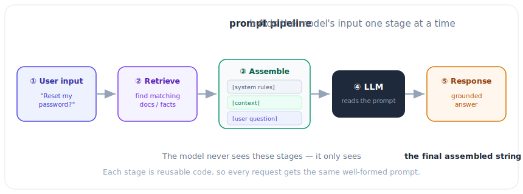

# 4.2 The Prompt Pipeline: Engineering the Input

[](https://colab.research.google.com/github/bzenowich/learnai/blob/main/notebooks/module-04-context/4.2-prompt-pipeline.ipynb)

When you type a prompt into a search engine or an AI app, it doesn't just go straight to the model. It passes through a series of "preprocessing" steps called the **[Prompt Pipeline](../glossary.md#prompt-pipeline)**. 

The goal of the pipeline is to turn your simple question into the most effective prompt possible.

## The Stages of the Pipeline



1.  **Input Transformation:** Cleaning and normalizing the user's text.
2.  **Context Amplification:** This is the most complex step! It's when the system adds the right "surrounding info" to help the model answer. 
    *   Example: If you ask "How's the weather?", the pipeline might look up your location and add it to the prompt.
3.  **Templating:** Fitting all that information into a specific format that the model was trained on. 
    *   Example: Using specialized tags like `<|user|>` and `<|assistant|>`.
4.  **Formatting & [Tokenization](../glossary.md#tokenization):** Turning the final text into Token IDs (../module-02-text/2.1-tokens.md).

## A Simple Prompt Pipeline in Python

Let's build a basic pipeline that adds a "persona" and some "contextual knowledge" to a user's question.

```python
# Our system prompt (the instructions)
SYSTEM_PROMPT = "You are a friendly math tutor. Explain concepts simply."

# A tiny database of context information
CONTEXT_DB = {
    "vector": "A vector is an ordered list of numbers like [1, 2, 3].",
    "dot product": "A dot product is the sum of multiplied corresponding elements."
}

def prompt_pipeline(user_query):
    # 1. Look for keywords in the query to find relevant context
    context_info = ""
    for keyword, info in CONTEXT_DB.items():
        if keyword in user_query.lower():
            context_info += f"\nContext: {info}"
    
    # 2. Template everything together
    final_prompt = f"""[SYSTEM]
{SYSTEM_PROMPT}

[CONTEXT]{context_info}

[USER]
{user_query}
"""
    return final_prompt

# Test our pipeline!
query = "What is a vector?"
formatted_prompt = prompt_pipeline(query)

print("The Final Prompt being sent to the LLM:")
print("-" * 30)
print(formatted_prompt)
```

Running this prints:

```text
The Final Prompt being sent to the LLM:
------------------------------
[SYSTEM]
You are a friendly math tutor. Explain concepts simply.

[CONTEXT]
Context: A vector is an ordered list of numbers like [1, 2, 3].

[USER]
What is a vector?
```

## Why We Need Pipelines

Modern AI applications use sophisticated pipelines to:
*   **Security:** Strip out sensitive data before it reaches the model.
*   **Performance:** Truncate long conversations so they fit in the [context window](../glossary.md#context-window).
*   **Retrieval (RAG):** Search through entire libraries of documents to find the perfect [context](../glossary.md#context-window) to add to the [prompt](../glossary.md#prompt).

## Summary of Context

[Context](../glossary.md#context-window) is the "Short-Term Memory" of an AI. It's built through careful structuring ([Anatomy](4.1-anatomy-of-a-prompt.md)) and automated processes (Pipelines) to ensure the model has everything it needs to give a high-quality response.

## Exercises

<details>
<summary>Show solution</summary>

**Exercise 1:** Build a simple prompt pipeline that adds multiple contexts and formats them. Given a user query about "vectors," extract relevant keywords and add corresponding context.

```python
CONTEXT_DB = {
    "vector": "An ordered list of numbers representing a point in space.",
    "dimension": "The number of elements in a vector.",
    "magnitude": "The length or norm of a vector."
}

def extract_context(query, db):
    contexts = []
    for keyword, info in db.items():
        if keyword in query.lower():
            contexts.append(f"{keyword.capitalize()}: {info}")
    return "\n".join(contexts)

query = "What is the magnitude of a vector?"
context = extract_context(query, CONTEXT_DB)

final_prompt = f"""[SYSTEM]
You are a helpful math tutor.

[CONTEXT]
{context}

[USER]
{query}"""

print(final_prompt)
```

Expected output:
```text
[SYSTEM]
You are a helpful math tutor.

[CONTEXT]
Vector: An ordered list of numbers representing a point in space.
Magnitude: The length or norm of a vector.

[USER]
What is the magnitude of a vector?
```

</details>

<details>
<summary>Show solution</summary>

**Exercise 2:** Demonstrate the performance stage of the pipeline: truncate a long conversation to fit within a token budget.

```python
def approximate_tokens(text):
    return len(text) // 4

def truncate_history(history_text, max_tokens):
    tokens = approximate_tokens(history_text)
    if tokens <= max_tokens:
        return history_text, tokens
    
    # Keep only the most recent part
    max_chars = max_tokens * 4
    truncated = history_text[-max_chars:]
    return truncated, approximate_tokens(truncated)

long_history = "Turn 1: Hello\n" * 50
budget = 100

truncated, tokens = truncate_history(long_history, budget)
print(f"Original history tokens: ~{approximate_tokens(long_history)}")
print(f"Truncated history tokens: {tokens}")
print(f"Budget: {budget} tokens")
print(f"Fits in budget: {tokens <= budget}")
```

Expected output shows tokens reduced from ~200 to ~100.

</details>

<details>
<summary>Show solution</summary>

**Exercise 3:** Create a pipeline function that applies all stages: transform input, add context, template it, and return the final [prompt](../glossary.md#prompt).

```python
def full_pipeline(user_input, system_prompt, context_db):
    # Stage 1: Transform (lowercase, strip whitespace)
    cleaned_input = user_input.strip().lower()
    
    # Stage 2: Context Amplification
    context = ""
    for keyword, info in context_db.items():
        if keyword in cleaned_input:
            context += f"\n{info}"
    
    # Stage 3: Template
    final_prompt = f"""[SYSTEM]
{system_prompt}
[CONTEXT]{context}
[USER]
{user_input}"""
    
    # Stage 4: Could tokenize here (return as-is for now)
    return final_prompt

# Test it
db = {"vector": "A vector is an ordered list of numbers."}
result = full_pipeline("What is a vector?", "You are helpful.", db)
print(result)
```

This demonstrates how all pipeline stages work together to produce a [prompt](../glossary.md#prompt) ready for the model.

</details>

---

**Up Next:** What happens when our [context window](../glossary.md#context-window) isn't big enough? How can we give an AI access to millions of documents? Let's explore **Module 5: Expanding the AI's Brain (RAG & Tools)**.
