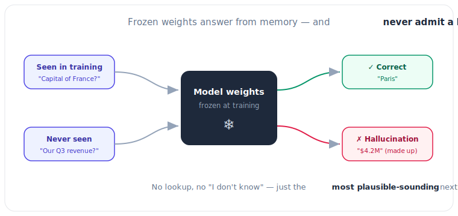

# 5.1 The Limits of Memory: Why Models Hallucinate

[](https://colab.research.google.com/github/bzenowich/learnai/blob/main/notebooks/module-05-rag-tools/5.1-limits-of-memory.ipynb)

Wait, if LLMs have trillions of parameters and were trained on the entire internet, why do they sometimes get facts wrong or make things up? 

This is what we call **[Hallucination](../glossary.md#hallucination)**, and it happens because of the fundamental way an LLM is built.

## Static Weights vs. Dynamic Knowledge



Remember **Weight Matrices** (Module 1.5)? Those matrices store everything the model "learned" during training. But there are two big problems:

1.  **Training Cutoff:** An AI model is like a time capsule. If it finished training in 2023, it doesn't know anything about events that happened in 2024 or 2025.
2.  **Probability, Not Truth:** An LLM's only job is to guess the next token based on *probability* (Module 3.4). It doesn't have a "fact-checker" in its brain. If it has seen the word "The" followed by "capital of France is" many times, it will likely say "Paris." But if you ask it something it *hasn't* seen, it will still try to guess the most *probable-looking* next word—even if that word is a lie!

## Visualizing the Problem: A Simple Experiment

Let's imagine our model has a tiny brain that only knows about 3 cities.

```python
# Our "Model Weights" (learned from training)
knowledge_base = {
    "London": "The capital of the UK.",
    "Tokyo": "The capital of Japan.",
    "Paris": "The capital of France."
}

def ask_the_model(city_name):
    # This simulates a probability engine with NO external info
    if city_name in knowledge_base:
        return knowledge_base[city_name]
    else:
        # The model "guesses" because it has no choice!
        return f"The capital of {city_name} is... [Guessing] Berlin?"

# Case 1: Known info (Works great!)
print(f"London: {ask_the_model('London')}")

# Case 2: Unknown info (Hallucination!)
print(f"San Francisco: {ask_the_model('San Francisco')}")
```

Running this prints:
```text
London: The capital of the UK.
San Francisco: The capital of San Francisco is... [Guessing] Berlin?
```

## How do we fix this?

Instead of relying *only* on the model's "internal memory" (its weights), we can give it an "external brain"—an enormous library of up-to-date documents that it can search through *before* it tries to answer.

This technique is called **[Retrieval-Augmented Generation (RAG)](5.2-rag.md)**.

## Exercises

<details>
<summary>Show solution</summary>

**1. Why does the model hallucinate on "San Francisco"?**

The model's knowledge base dictionary only contains three cities: London, Tokyo, and Paris. When asked about San Francisco (a city not in its training data), the model has no learned weights about it. Following its design, it tries to generate a "probable-looking" answer by guessing "Berlin" — even though this is factually wrong. This illustrates the core problem: LLMs generate text based on statistical patterns, not fact-checking.

</details>

<details>
<summary>Show solution</summary>

**2. How would RAG solve the hallucination problem?**

Instead of relying on the `knowledge_base` dictionary (the model's fixed weights), we could give the model access to an external document database. Before answering "What is San Francisco?", RAG would retrieve a document like "San Francisco is a city in California known for tech and fog." The model would then read this document and generate an accurate answer based on the provided context, not from its internal (incomplete) weights.

</details>

<details>
<summary>Show solution</summary>

**3. Modify the code to add a fourth city to the knowledge base and test it.**

```python
knowledge_base = {
    "London": "The capital of the UK.",
    "Tokyo": "The capital of Japan.",
    "Paris": "The capital of France.",
    "Berlin": "The capital of Germany."
}

def ask_the_model(city_name):
    if city_name in knowledge_base:
        return knowledge_base[city_name]
    else:
        return f"The capital of {city_name} is... [Guessing] Unknown?"

print(ask_the_model("Berlin"))  # Now it returns the correct fact
```

Expected output:
```text
The capital of Germany.
```

</details>

---

**Up Next:** Let's learn how to give our AI a library card with **5.2 Retrieval-Augmented Generation (RAG)**.
