# 5.2 Retrieval-Augmented Generation (RAG): Giving the AI a Library

[](https://colab.research.google.com/github/bzenowich/learnai/blob/main/notebooks/module-05-rag-tools/5.2-rag.ipynb)

How can we stop an AI from hallucinating? One of the most powerful tools is **[RAG (Retrieval-Augmented Generation)](../glossary.md#retrieval-augmented-generation)**. 

RAG is like giving the AI a "library card." Instead of forcing the AI to remember every fact, we let it search through an external collection of documents and use that information to construct its answer.

## The RAG Process: Retrieve, Then Generate

When you ask a RAG-enabled system a question, it follows three steps:



1.  **Retrieve:** The system converts your question into a vector ([Module 2.2](../module-02-text/2.2-embeddings.md)). It then uses a **[Dot Product](../glossary.md#dot-product)** ([Module 1.2](../module-01-math/1.2-dot-products.md)) to search through a database of millions of "document vectors" to find the most relevant ones.
2.  **Augment:** The text from those documents is "pasted" into your prompt as context.
3.  **Generate:** The AI reads both your question and the documents to generate a final, fact-based response.

## Why this Works

By adding the documents to the prompt, we are using the model's **Short-Term Memory** (the **[Context Window](../glossary.md#context-window)**) instead of relying on its **Internal Weights**. 

The AI's job changes from "Remember this fact" to "Read this paragraph and answer the question." This is much easier for an LLM to do accurately!

## A RAG Pipeline in Python

Let's build a tiny RAG system using the vector similarity math we learned earlier.

```python
import numpy as np

# 1. Our Library of Documents (with pre-calculated embeddings!)
# [Royalty, Fruitiness, Tech]
docs = {
    "The apple is a sweet fruit often found in pies.": np.array([0.1, 0.9, 0.0]),
    "A king is the male ruler of a sovereign state.": np.array([0.9, 0.0, 0.1]),
    "Python is a popular programming language for AI.": np.array([0.2, 0.1, 0.9])
}

def retrieve_best_doc(query_vector):
    # Find the doc with the highest dot product (similarity)
    best_doc = None
    best_score = -1
    
    for doc_text, doc_vector in docs.items():
        score = np.dot(query_vector, doc_vector)
        if score > best_score:
            best_score = score
            best_doc = doc_text
            
    return best_doc

# 2. The User Query ("What is a king?")
# Our "Query Vector" looks like [Royalty, Fruitiness, Tech]
query_v = np.array([0.8, 0.0, 0.2])

# 3. Retrieve the context!
context = retrieve_best_doc(query_v)

# 4. Construct the Final Prompt for the AI
final_prompt = f"""Use the following context to answer the user question.
Context: {context}

User Question: What is a king?
"""

print(final_prompt)
```

Running this prints:
```text
Use the following context to answer the user question.
Context: A king is the male ruler of a sovereign state.

User Question: What is a king?
```

## Summary of RAG

RAG is a "win-win" for AI:
*   **Up-to-Date:** You can update the document library anytime without retrying the whole model.
*   **Traceability:** The AI can cite its sources ("According to the context, a king is...").
*   **Accuracy:** It dramatically reduces hallucinations.

## Exercises

<details>
<summary>Show solution</summary>

**1. Why does RAG use dot product for document retrieval?**

Dot product measures the similarity between two vectors. By converting the user's question and documents into vectors and computing their dot product, we get a similarity score. Higher scores indicate more relevant documents. This is efficient (fast) and effective (finds semantically similar content) for retrieving the best context to augment the prompt.

</details>

<details>
<summary>Show solution</summary>

**2. What happens if the retrieved document is still incorrect?**

RAG doesn't guarantee correctness—it only retrieves documents from your database. If the document database itself contains false information, RAG will still present it. RAG reduces hallucinations by using external facts, but those external facts must be trustworthy. Always validate your document sources.

</details>

<details>
<summary>Show solution</summary>

**3. Modify the RAG example to retrieve multiple (top 2) documents instead of just the best one.**

```python
import numpy as np

docs = {
    "The apple is a sweet fruit often found in pies.": np.array([0.1, 0.9, 0.0]),
    "A king is the male ruler of a sovereign state.": np.array([0.9, 0.0, 0.1]),
    "Python is a popular programming language for AI.": np.array([0.2, 0.1, 0.9])
}

def retrieve_top_n_docs(query_vector, n=2):
    scores = [(doc, np.dot(query_vector, vec)) for doc, vec in docs.items()]
    scores.sort(key=lambda x: x[1], reverse=True)
    return [doc for doc, score in scores[:n]]

query_v = np.array([0.8, 0.0, 0.2])
top_docs = retrieve_top_n_docs(query_v, n=2)
for i, doc in enumerate(top_docs, 1):
    print(f"{i}. {doc}")
```

Expected output:
```text
1. A king is the male ruler of a sovereign state.
2. Python is a popular programming language for AI.
```

</details>

---

**Up Next:** RAG is great for documents, but what if the AI needs to check the weather or search the live web? Let's look at **[5.3 Dynamic Context](5.3-dynamic-context.md)**.
