# 6.5 Level 5: Thinking Models & Multi-Agent Systems

[](https://colab.research.google.com/github/bzenowich/learnai/blob/main/notebooks/module-06-evolution/6.5-thinking-multi-agent.ipynb)

We have reached the pinnacle of AI architectures: **Level 5: Thinking Models & Multi-Agent Systems**. This is the absolute cutting edge of the field.

## What is a Level 5 AI System?

At Level 5, we move beyond a single AI model or even a single agent. Instead, we have a [Multi-Agent System](../glossary.md#multi-agent-system) that can collaborate, delegate, and debate with each other to solve extremely complex problems.

### The Multi-Agent Architecture

Imagine a "Manager Agent" that receives a massive task like "Build a new e-commerce website." 

1.  **Decompose:** The Manager breaks the task into parts: Database, Frontend, and Backend.
2.  **Delegate:** It assigns each part to a specialized worker agent:
    *   **The Database Agent:** Designs the SQLite schema.
    *   **The Frontend Agent:** Writes the HTML and CSS.
    *   **The Backend Agent:** Writes the Python API.
3.  **Review & Debate:** A separate "Quality Assurance Agent" reviews the code and reports bugs back to the others.
4.  **Synthesize:** The Manager integrates all the pieces into a final working product.

## Visualizing Level 5 in Python

```python
def manager_agent(task):
    print(f"[Manager]: Received task: {task}")
    print("[Manager]: Decomposing task into sub-tasks...")
    
    # Delegate to workers
    db_result = database_worker()
    frontend_result = frontend_worker()
    backend_result = backend_worker()
    
    print(f"[Manager]: All workers done. Synthesizing results...")
    return f"Project complete: DB schema, frontend code, and backend API ready."

def database_worker():
    print("[Database Agent]: Designing SQLite schema...")
    return {"schema": "users, posts, comments tables"}

def frontend_worker():
    print("[Frontend Agent]: Writing HTML/CSS...")
    return {"html": "index.html, dashboard.html"}

def backend_worker():
    print("[Backend Agent]: Writing Python API...")
    return {"api": "Flask app with /users, /posts endpoints"}

print(manager_agent("Build an e-commerce website"))
```

Running this prints:

```text
[Manager]: Received task: Build an e-commerce website
[Manager]: Decomposing task into sub-tasks...
[Database Agent]: Designing SQLite schema...
[Frontend Agent]: Writing HTML/CSS...
[Backend Agent]: Writing Python API...
[Manager]: All workers done. Synthesizing results...
Project complete: DB schema, frontend code, and backend API ready.
```

## Why this is Revolutionary

Multi-agent systems allow AI to tackle problems that are too large for any single model's context window. They provide:
*   **Specialization:** Every [agent](../glossary.md#agent) can have its own [system prompt](../glossary.md#system-prompt) ([4.1 Anatomy of a Prompt](../module-04-context/4.1-anatomy-of-a-prompt.md)) and its own set of [MCP](../glossary.md#model-context-protocol) tools ([5.4 Model Context Protocol](../module-05-rag-tools/5.4-mcp.md)).
*   **Parallelism:** Many agents can work at the same time, speeding up the process.
*   **Superior Logic:** By "debating" and checking each other's work, the error rate drops significantly.

## Exercises

<details>
<summary>Show solution</summary>

**Exercise 1:** Create a simple multi-agent system where a manager delegates a task to two worker agents: one for research and one for writing. Show how they coordinate.

```python
def manager_with_coordination(task):
    print(f"[Manager]: Task received: {task}")
    
    print("[Manager]: Asking Research Agent to gather data...")
    research_data = research_agent()
    
    print("[Manager]: Asking Writing Agent to create output...")
    written_output = writing_agent(research_data)
    
    print("[Manager]: Combining results...")
    return f"Final output: {written_output}"

def research_agent():
    print("[Research Agent]: Searching for information...")
    return "Statistics show 90% of AI is math and data"

def writing_agent(data):
    print("[Writing Agent]: Drafting report...")
    return f"Report: {data}"

print(manager_with_coordination("Write a report on AI fundamentals"))
```

Expected output:
```
[Manager]: Task received: Write a report on AI fundamentals
[Manager]: Asking Research Agent to gather data...
[Research Agent]: Searching for information...
[Manager]: Asking Writing Agent to create output...
[Writing Agent]: Drafting report...
[Manager]: Combining results...
Final output: Report: Statistics show 90% of AI is math and data
```

</details>

<details>
<summary>Show solution</summary>

**Exercise 2:** What is a [multi-agent system](../glossary.md#multi-agent-system) and why is it better than a single large agent for complex tasks?

**Answer:** A [multi-agent system](../glossary.md#multi-agent-system) divides work among specialized agents, each with its own tools and [system prompt](../glossary.md#system-prompt). This is better than one large agent because: (1) Each agent stays focused on its specialty, (2) Agents can work in parallel, (3) Problems are broken into smaller chunks that fit each agent's context window, and (4) Agents can validate each other's work. Single large agents often struggle with multi-step problems and context limits.

</details>

## Summary of the Journey

From basic math in Module 1 to multi-agent collaboration in Module 6, you've now seen the entire roadmap of how modern AI works.



*   **Module 1:** Math (Vectors/Matrices)
*   **Module 2:** Language (Tokens/Embeddings)
*   **Module 3:** Architecture (Attention/Transformers)
*   **Module 4:** Context (Anatomy/Pipelines)
*   **Module 5:** Expansion (RAG/MCP/Tools)
*   **Module 6:** Evolution (Simple Chat $\rightarrow$ Multi-Agent Systems)

## Conclusion: The Future is in Your Hands

AI is no longer a "black box" of magic. It is an elegant system of math, language, and logic. Now that you understand how the engine works, you have the power to use it, build with it, and shape its future.

---

**Congratulations on completing the course!** Keep experimenting, keep coding, and keep asking "How does this work?"
