# 1.5 From Math to Neurons: Building a Tiny Brain

We've covered the fundamental tools: **Vectors**, **Dot Products**, **Matrices**, and **Matrix-Vector Multiplication**. Now, let's see how these math concepts come together to create the "neurons" that make up an AI's brain.

## What is a Neuron?

In an AI, a "neuron" is just a mathematical function that takes some inputs, does a calculation, and spits out an output. A **Layer** is just a collection of these neurons working together.

Every layer in a neural network follows a simple three-step process:



1.  **Weights ($W$):** Multiply the input vector by a weight matrix (Matrix-Vector Multiplication).
2.  **Bias ($b$):** Add a small "nudge" to the result (Vector Addition).
3.  **Activation Function ($f$):** Pass the final result through a simple "decision" function.

The whole thing can be written as one elegant formula:
$$y = f(Wx + b)$$

## Step 1: Weights ($W$)

The **Weights** are the most important part. They represent the "knowledge" of the model. By multiplying the input vector by the weight matrix, the AI transforms the data into something more meaningful.

## Step 2: Bias ($b$)

Sometimes, even if the weights are perfect, the result needs a little adjustment. The **Bias** is just a vector that we add to the result. It allows the model to be more flexible.

## Step 3: Activation Functions ($f$)

This is where the magic happens. If we *only* used weights and biases, our AI would just be a series of simple linear transformations. But real-world problems are complex!

An **Activation Function** is a simple rule that adds "non-linearity." The most common one in AI is called **ReLU** (Rectified Linear Unit). Its rule is simple: **If a number is negative, turn it into 0. If it's positive, keep it as it is.**

$$ReLU(x) = \max(0, x)$$

## Building a Neuron Layer in Python

Let's build a tiny "layer" with 3 neurons that takes 3 inputs.

```python
import numpy as np

# Step 0: Our input vector (e.g., three properties of a word)
x = np.array([1.5, -2.0, 0.5])

# Step 1: Weight Matrix (learned by the AI over time)
W = np.array([
    [0.1, 0.5, -0.1],
    [0.2, -0.3, 0.8],
    [0.9, 0.1, -0.4]
])

# Step 2: Bias Vector (also learned by the AI)
b = np.array([0.1, 0.2, 0.1])

# Step 3: Perform the calculation
# Multiply weights by input and add bias
linear_step = (W @ x) + b

# Step 4: Apply the Activation Function (ReLU)
# np.maximum(0, array) compares every element to 0
y = np.maximum(0, linear_step)

print(f"Input Vector (x): {x}")
print(f"Linear Result (Wx + b): {linear_step}")
print(f"Final Neuron Output (y): {y}")
```

In this example, the neurons transformed the input `x` into the output `y`. This is the fundamental loop of *every* AI model on the planet!

## Summary of Module 1

Congratulations! You've mastered the math behind AI:
*   **Vectors:** How an AI represents data.
*   **Dot Products:** How an AI measures similarity.
*   **Matrices:** How an AI stores transformations and knowledge.
*   **Matrix-Vector Multiplication:** The engine that processes data.
*   **Neurons:** Combining it all together into a "brain."

---

**Up Next:** Now that we understand the math, let's see how an AI uses it to understand human language in **Module 2: How AI Understands Text**.
