# 2.1 Tokenization: Translating Text into Numbers

We know that an AI's brain is made of math. But how do we turn a sentence like "I love robots" into something that a matrix-vector multiplication can understand?

The first step in that translation process is called **Tokenization**.



## What is a Token?

A "Token" is a small chunk of text that an AI uses as its basic unit of meaning. If you think of a sentence as a Lego set, tokens are the individual blocks used to build it.

There are three main ways to tokenize text:

1.  **Word-Level:** Every word is a token. 
    *   Example: `["I", "love", "robots"]`
    *   *Problem:* This leads to a massive vocabulary. "Run," "Running," and "Runner" are all treated as completely different things.
2.  **Character-Level:** Every single letter is a token.
    *   Example: `["I", " ", "l", "o", "v", "e", " ", "r", "o", "b", "o", "t", "s"]`
    *   *Problem:* It's hard for the AI to learn the meaning of words if it's only looking at one letter at a time.
3.  **Sub-word Level:** This is the "sweet spot" used by modern AI like ChatGPT. It breaks words into smaller, meaningful pieces.
    *   Example: `["I", " love", " robot", "s"]`
    *   *Benefit:* It can handle new words by breaking them down into parts it already knows (e.g., "un-helpful-ly").

## A Simple Tokenizer in Python

Let's build a very basic word-level tokenizer to see how it works. We'll create a **Vocabulary** (a dictionary that maps words to numbers).

```python
# Our tiny training dataset
corpus = "I love AI. AI is the future. I love robots."

# 1. Clean and split the text into words
words = corpus.lower().replace(".", "").split()

# 2. Create a unique list of words (our Vocabulary)
vocab = sorted(list(set(words)))

# 3. Create a dictionary to map words to unique ID numbers
word_to_id = {word: i for i, word in enumerate(vocab)}
id_to_word = {i: word for i, word in enumerate(vocab)}

print("Our Vocabulary:")
print(word_to_id)

# 4. Tokenize a new sentence!
sentence = "I love AI"
tokens = [word_to_id[word] for word in sentence.lower().split()]

print(f"\nOriginal Sentence: {sentence}")
print(f"Tokenized IDs: {tokens}")
```

In this example, the sentence "I love AI" was converted into a list of numbers like `[2, 3, 0]`.

## Why Numbers?

Now that our sentence is a list of numbers, we can use those numbers as **indices** (addresses) to look up something even more powerful: **Embeddings**.

---

**Up Next:** Now that we have token IDs, let's turn them into vectors in **2.2 Embeddings**.
