# 2.3 Vector Space & Similarity: Math with Meaning

In Module 1, we learned that the **Dot Product** can be used as a "similarity score" for two vectors. Now that we have **Embeddings** (vectors that represent the meaning of words), we can use the dot product to find similar words programmatically.

## Vector Space

The "Vector Space" is the multidimensional mathematical world where all embeddings live. In this space, words with similar meanings are naturally clustered together.

But there's a catch! When we compare two vectors using the dot product, the *length* of the vector can sometimes interfere with the result. To fix this, we use **Cosine Similarity**.

### Cosine Similarity: Normalizing for Length

Cosine similarity is simply the dot product of two vectors, but we "normalize" them first to make sure they are both the same length (usually a length of 1). This allows us to focus *only* on the direction of the vector (its "meaning").

The result of a cosine similarity calculation is always a single number between `-1` and `1`:
*   **1:** The words are identical in meaning.
*   **0:** The words have no relationship at all.
*   **-1:** The words have opposite meanings.

## Doing Math with Words

One of the most famous examples of vector space is "Word Analogies." If the embeddings are trained correctly, you can actually add and subtract word vectors to "reason" about their relationships:

**King - Man + Woman ≈ Queen**



This works because the vector representing "gender" is added or subtracted from the vector representing "royalty."

## Python Example: Similarity and Analogies

Let's see this in action using NumPy.

```python
import numpy as np

# Let's define some simplified embedding vectors
# [Royalty, Gender (Male to Female), Fruitiness]
king = np.array([0.9, -0.8, 0.1])
man = np.array([0.1, -0.9, 0.0])
woman = np.array([0.1, 0.9, 0.0])
queen = np.array([0.9, 0.8, 0.1])
apple = np.array([0.0, 0.1, 0.9])

def cosine_similarity(v1, v2):
    # The formula: (v1 . v2) / (length(v1) * length(v2))
    dot_product = np.dot(v1, v2)
    norm_v1 = np.linalg.norm(v1) # This calculates the length of the vector
    norm_v2 = np.linalg.norm(v2)
    return dot_product / (norm_v1 * norm_v2)

# 1. Compare Similarity
print(f"Similarity (King vs. Queen): {cosine_similarity(king, queen):.4f}")
print(f"Similarity (King vs. Apple): {cosine_similarity(king, apple):.4f}")

# 2. Perform the Word Analogy
# Let's see if King - Man + Woman is close to Queen
result_vector = king - man + woman
print(f"\nAnalogy Result Similarity (Result vs. Queen): {cosine_similarity(result_vector, queen):.4f}")
```

## Summary of Module 2

We've now seen how human language is translated into a form that an AI can process:
*   **Tokenization:** Breaking text into IDs.
*   **Embeddings:** Mapping IDs to vectors.
*   **Vector Space:** Using math like Cosine Similarity to compare and even reason about those vectors.

---

**Up Next:** Now that we have the pieces, let's put them together! In **Module 3: Inside the Large Language Model**, we'll see how an AI model takes these word vectors and uses its "Attention Mechanism" to understand whole sentences.
