# 4.1 Anatomy of a Prompt: Structuring Context

We've learned how the AI processes a single prompt. But what *is* a prompt? 

When you type a simple question into ChatGPT, it's rarely just your question that goes into the AI. To make the model useful and relevant, we surround your question with a specific structure called **Context**.

## The Layers of a Modern Prompt

A typical AI prompt is made of four main components:



1.  **System Instructions (The 'Persona'):** These are the high-level rules that tell the AI how to behave. 
    *   Example: "You are a helpful assistant who is an expert in Python and math."
2.  **Conversation History (The 'Memory'):** LLMs are "stateless," meaning they don't naturally remember what you said 5 seconds ago. To simulate memory, the developers literally "paste" your previous messages back into the prompt every time you send a new one!
3.  **User Question (The 'Query'):** This is the core piece of information the user wants processed.
4.  **Referenced Documents (The 'Context'):** If you upload a PDF or paste a link, that text is added to the prompt to help the AI answer your question.

## Why Structure Matters

The way these pieces are organized is critical. Modern models use specific "tags" to help the Attention Mechanism (Module 3.2) know which part of the text is a system instruction and which is the user's question.

### Example Structured Prompt

```text
[SYSTEM]
You are a helpful, concise tutor for high school students. 
Always provide one Python example with your answers.

[HISTORY]
User: What is a vector?
Assistant: A vector is an ordered list of numbers. 
           Example: `v = np.array([1, 2, 3])`

[USER]
How do I multiply two of them together?
```

## The Role of the Context Window

Every AI model has a **Context Window** (e.g., 128,000 tokens or 1 million tokens). This is the maximum amount of text the model can "see" at one time. 

If your conversation gets too long and exceeds the Context Window:
1.  The oldest messages are dropped.
2.  The model "forgets" what happened at the beginning of the chat.

## Summary of Prompting

A prompt is more than just a question; it's a carefully crafted package of instructions, history, and data that sets the stage for the model's next-token prediction.

---

**Up Next:** How does this structure get built automatically? Let's look at **4.2 The Prompt Pipeline**.
