# 6.5 Level 5: Thinking Models & Multi-Agent Systems

We have reached the pinnacle of AI architectures: **Level 5: Thinking Models & Multi-Agent Systems**. This is the absolute cutting edge of the field.

## What is a Level 5 AI System?

At Level 5, we move beyond a single AI model or even a single agent. Instead, we have a **System of Agents** that can collaborate, delegate, and debate with each other to solve extremely complex problems.

### The Multi-Agent Architecture

Imagine a "Manager Agent" that receives a massive task like "Build a new e-commerce website." 

1.  **Decompose:** The Manager breaks the task into parts: Database, Frontend, and Backend.
2.  **Delegate:** It assigns each part to a specialized worker agent:
    *   **The Database Agent:** Designs the SQLite schema.
    *   **The Frontend Agent:** Writes the HTML and CSS.
    *   **The Backend Agent:** Writes the Python API.
3.  **Review & Debate:** A separate "Quality Assurance Agent" reviews the code and reports bugs back to the others.
4.  **Synthesize:** The Manager integrates all the pieces into a final working product.

## Why this is Revolutionary

Multi-agent systems allow AI to tackle problems that are too large for any single model's context window. They provide:
*   **Specialization:** Every agent can have its own system instructions (Module 4.1) and its own set of MCP tools (Module 5.4).
*   **Parallelism:** Many agents can work at the same time, speeding up the process.
*   **Superior Logic:** By "debating" and checking each other's work, the error rate drops significantly.

## Summary of the Journey

From basic math in Module 1 to multi-agent collaboration in Module 6, you've now seen the entire roadmap of how modern AI works.

*   **Module 1:** Math (Vectors/Matrices)
*   **Module 2:** Language (Tokens/Embeddings)
*   **Module 3:** Architecture (Attention/Transformers)
*   **Module 4:** Context (Anatomy/Pipelines)
*   **Module 5:** Expansion (RAG/MCP/Tools)
*   **Module 6:** Evolution (Simple Chat $\rightarrow$ Multi-Agent Systems)

## Conclusion: The Future is in Your Hands

AI is no longer a "black box" of magic. It is an elegant system of math, language, and logic. Now that you understand how the engine works, you have the power to use it, build with it, and shape its future.

---

**Congratulations on completing the course!** Keep experimenting, keep coding, and keep asking "How does this work?"
